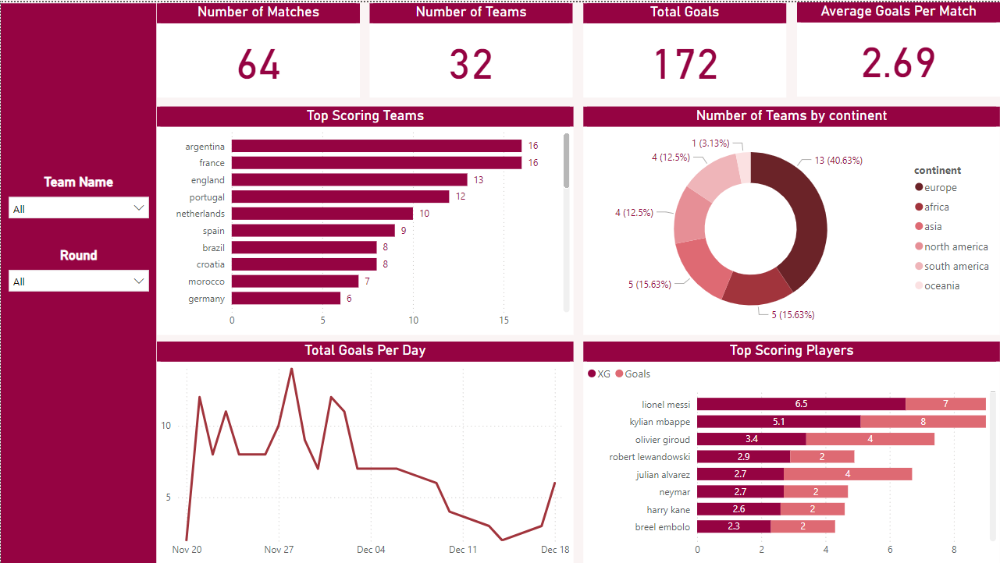
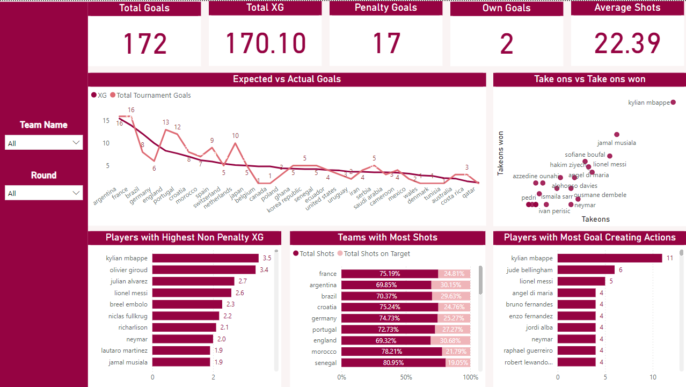
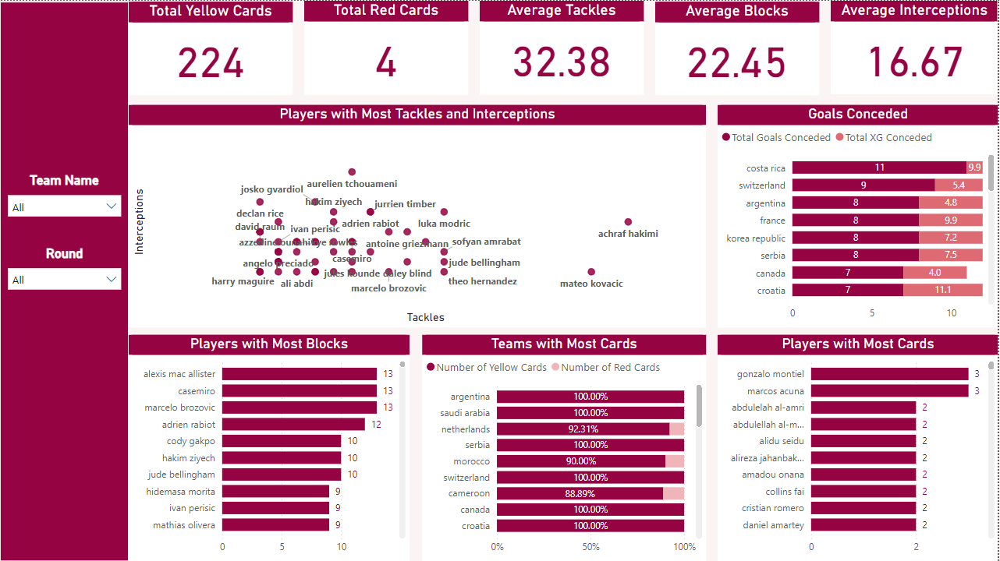

# FIFA World Cup 2022 Data Pipeline and Analysis
This project focuses on developing a comprehensive data pipeline to process and analyze data from the FIFA World Cup 2022. The pipeline extracts data from various sources, transforms it, 
and loads it into a centralized data warehouse. This enables detailed analysis and valuable insights into the performance of teams and players throughout the tournament.

## Tech Stack & Tools
- **Data Warehouse**: SQL Server
- **ETL Scripts**: Jupyter & Python
- **Serving Layer**: Power BI

## Pipeline Architecture
1. **Data Extraction**: The pipeline uses Python to extract data from multiple sources such as: CSV files, operational database, and data scraped from the web.
2. **Data Transformation**: after extraction, the Python scripts perform transformations to: clean and format data (e.g., handling missing values, unifying data types),
integrate data from multiple sources if needed (e.g., joining tables from CSV and OLTP database), ensure compatibility with the data warehouse schema.
3. **Data Loading**: The transformed data is loaded into SQL Server, where it’s structured into fact and dimension tables to support analytical queries. **Data model overview**:

4. **Data Viusalization**: Power BI connects to the data warehouse in SQL Server, pulling data for reports and dashboards. Visualizations and insights are created to report on trends and patterns

## 

